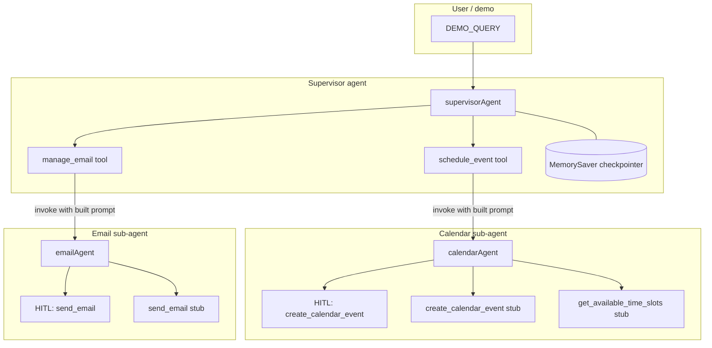
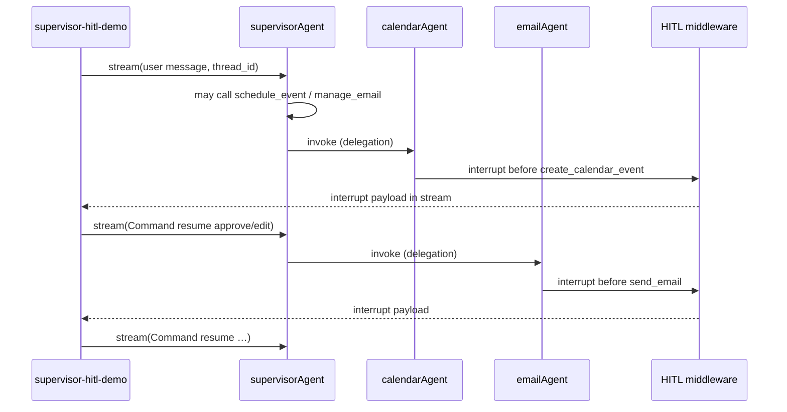

# Personal assistant

https://github.com/user-attachments/assets/f4aa0078-e8d4-4649-b624-79d14ec03f13


**Tech stack**

[](https://www.typescriptlang.org/)
[](https://nodejs.org/)
[](https://pnpm.io/)
[](https://js.langchain.com/)
[](https://docs.langchain.com/oss/javascript/langgraph/overview)
[](https://platform.openai.com/)
[](https://zod.dev/)

**Design patterns**

[](#architecture)
[](#architecture)
[](#what-this-project-helps-you-learn)
[](#what-this-project-helps-you-learn)
[](#what-this-project-helps-you-learn)

A small TypeScript playground: a **supervisor agent** coordinates **calendar** and **email** sub-agents, with **human-in-the-loop** pauses before sensitive tool calls, **LangGraph** streaming, and a **checkpointer** so the graph can resume after approvals.

---

## What this project helps you learn

| Topic                            | What you practice here                                                                                                                                |
| -------------------------------- | ----------------------------------------------------------------------------------------------------------------------------------------------------- |
| **Supervisor pattern**           | A top-level agent delegates work through tools (`schedule_event`, `manage_email`) that each run a full sub-agent, instead of one flat tool list.      |
| **Sub-agents as tools**          | Calendar and email agents are normal LangChain agents with their own prompts and tools; the supervisor sees only the delegation tools.                |
| **Human-in-the-loop**            | `humanInTheLoopMiddleware` interrupts before `create_calendar_event` and `send_email` so a human can approve, edit, or reject before execution.       |
| **LangGraph + resume**           | `MemorySaver` checkpoints state; after an interrupt you build a `Command({ resume })` payload and stream again to continue the same thread.           |
| **Streaming**                    | `supervisorAgent.stream(..., { streamMode: "messages", configurable: { thread_id } })` to observe message updates and interrupt arrays incrementally. |
| **Thread context in delegation** | Delegation tools use `getCurrentTaskInput` + `HumanMessage` to pass the original user message into the sub-agent prompt.                              |
| **TypeScript + pnpm**            | ESM (`"type": "module"`), `NodeNext` resolution, `.js` extensions in imports, `dotenv`, and `@types/node` for `process.env`.                          |
| **Structured logging**           | A custom terminal logger (`src/lib/pretty-logger.ts`) to trace stream chunks, HITL payloads, tool I/O, and timing without extra npm deps.             |

Stub tools in `src/tools/calendar-api.ts` and `src/tools/email-api.ts` stand in for real APIs (Google Calendar, Gmail, etc.), so you can focus on agent orchestration first.

---

## Architecture

High-level data and control flow:



Runtime sequence (simplified):



---

## Repository layout

| Path                                         | Role                                                                             |
| -------------------------------------------- | -------------------------------------------------------------------------------- |
| `src/index.ts`                               | Entry: banner, dynamic import of demo (so logs order cleanly).                   |
| `src/config/llm.ts`                          | Shared `ChatOpenAI` instance.                                                    |
| `src/prompts/supervisor-demo.ts`             | System prompts for supervisor + sub-agents.                                      |
| `src/tools/calendar-api.ts` / `email-api.ts` | Low-level stub tools (where HITL attaches for sensitive actions).                |
| `src/tools/delegation.ts`                    | Supervisor-facing tools that call sub-agents with thread context.                |
| `src/agents/*.ts`                            | `calendarAgent`, `emailAgent`, `supervisorAgent` definitions.                    |
| `src/demo/supervisor-hitl-demo.ts`           | Full scripted flow: stream → inspect interrupts → resume → optional second wave. |
| `src/lib/pretty-logger.ts`                   | ANSI logging helpers for learning and debugging.                                 |

---

## Quick start

```bash
pnpm install
cp .env.example .env
# Set OPENAI_API_KEY in .env

pnpm run build
pnpm start
```

Requires **Node 20+** (see `package.json` `engines`).

